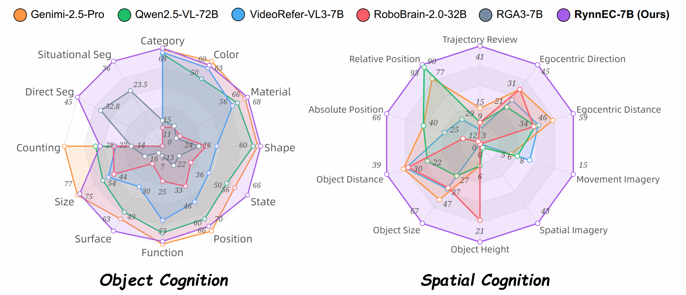

<p align="center">
    
<p>

<h3 align="center"><a href="" style="color:#9C276A">
RynnEC: Bringing MLLMs into Embodied World</a></h3>
<h5 align="center"> If our project helps you, please give us a star ⭐ on GitHub to support us. 🙏🙏 </h2>


<h5 align="center">

[](https://github.com/alibaba-damo-academy/RynnEC/blob/main/LICENSE) 
[](https://huggingface.co/collections/Alibaba-DAMO-Academy/rynnec-6893547fe802ace82cee8884)
[](https://huggingface.co/datasets/Alibaba-DAMO-Academy/RynnEC-Bench)
[](https://huggingface.co/spaces/Alibaba-DAMO-Academy/RynnEC)
[](https://www.youtube.com/watch?v=vsMxbzsmrQc)

[](https://www.modelscope.cn/collections/RynnEC-969b7cafd2d344)
[](https://www.modelscope.cn/models/DAMO_Academy/RynnEC-Bench)
[](https://arxiv.org/abs/2508.14160) 
</h5>

https://github.com/user-attachments/assets/3c12371e-ce95-4465-bc51-bff0b13749b5


## 📰 News
* **[2025.08.17]**  🤗 [RynnEC-7B model](https://huggingface.co/Alibaba-DAMO-Academy/RynnEC-7B) checkpoint has been released in Huggingface.
* **[2025.08.08]**  🔥🔥 Release our [RynnEC-2B model](https://huggingface.co/Alibaba-DAMO-Academy/RynnEC-2B), [RynnEC-Bench](https://huggingface.co/datasets/Alibaba-DAMO-Academy/RynnEC-Bench) and training code.


## 🌟 Introduction
**RynnEC** is a video multi-modal large language model (MLLM) specifically designed for embodied cognition
tasks. 

<p align="center">
    
<p>


## 🛠️ Requirements and Installation

Basic Dependencies:

* Python >= 3.10
* Pytorch >= 2.4.0
* CUDA Version >= 11.8
* transformers >= 4.46.3

Install required packages:


```bash
git clone https://github.com/alibaba-damo-academy/RynnEC
cd RynnEC
pip install -e .
pip install flash-attn --no-build-isolation
```

## 🌎 Model Zoo

| Model                | Base Model   | HF Link                                                      |
| -------------------- | ------------ | ------------------------------------------------------------ |
| RynnEC-2B       | Qwen2.5-1.5B-Instruct   | [Alibaba-DAMO-Academy/RynnEC-2B](https://huggingface.co/Alibaba-DAMO-Academy/RynnEC-2B) |
| RynnEC-7B       | Qwen2.5-7B-Instruct   | [Alibaba-DAMO-Academy/RynnEC-7B](https://huggingface.co/Alibaba-DAMO-Academy/RynnEC-7B) |


### CookBook
Checkout [inference notebooks](inference/notebooks/) that demonstrate how to use RynnEC on various applications such as basic object understanding, spatial understanding and video object segmentation in egocentric world.

| Notebooks                | Description   |
| :-------------------- | ------------------------------------------------------------------------ |
| [Object Understanding](inference/notebooks/1.object_understanding.ipynb)      | Demonstrates how to use RynnEC for **general object recognition and understanding** |
| [Spatial Understanding](inference/notebooks/2.spatial_understanding.ipynb)       | Demonstrations of using RynnEC for **spatial understanding** with 3D awareness|
| [Video Object Segmentation](inference/notebooks/3.object_segmentation.ipynb) | Demonstrations of using RynnEC for **video object segmentation** with text-based instructions|

## 🤗 Demo

It is highly recommended to try our [online demo](https://huggingface.co/spaces/Alibaba-DAMO-Academy/RynnEC) first.

Otherwise, you can launch a gradio app locally:

```bash
python inference/gradio_demo.py --model-path Alibaba-DAMO-Academy/RynnEC-2B

options:
  --model-path MODEL_PATH, --model_path MODEL_PATH
  --port SERVER_PORT, --server_port SERVER_PORT
  	Optional. Port of the model server.
```

## 🕹️ RynnEC-Bench
RynnEC-Bench evaluates the models in two key areas: `object cognition` and `spatial cognition`, evaluating a total of `22` embodied cognitive abilities.

<p align="center">
    
<p>

For more details, please refer to [RynnEC-Bench](benchmark).


## 🚀 Training

### Step1: Prepare training data
To use our training code, please organize the annotation files in the following format:
```json
[
    // image QA
    {
        "image": ["images/xxx.jpg"],
        "conversations": [
            {
                "from": "human",
                "value": "<image>\nWhat are the colors of the bus in the image?"
            },
            {
                "from": "gpt",
                "value": "The bus in the image is white and red."
            },
            ...
        ]
    },
    // Video QA
    {
        "video": ["videos/xxx.mp4"],
        "conversations": [
            {
                "from": "human",
                "value": "<video>\nWhat are the main activities that take place in the video?"
            },
            {
                "from": "gpt",
                "value": "The main activities that take place in the video are the preparation of camera equipment by a man, a group of men riding a helicopter, and a man sailing a boat through the water."
            },
            ...
        ]
    },
    // Video-object QA (mp4 file)
    {
        "video": ["videos/xxx.mp4"],
        "conversations": [
            {
                "from": "human", 
                "value": "<video>\nWhat is the color of <region>?"
            }, 
            {
                "from": "gpt", 
                "value": "The color is red."
            }
        ],
        "masks": [
            {
                "frame id": {"size": [1080, 1920], "counts": "mask rle"},
                "frame id": {"size": [1080, 1920], "counts": "mask rle"}
            }
        ],
    },
    // Video-object QA (image files)
    {
        "video": ["videos/xxx/0.png", "videos/xxx/1.png", "videos/xxx/2.png", ...],
        "conversations": [
            {
                "from": "human", 
                "value": "<video>\nWhat is the color of <region>?"
            }, 
            {
                "from": "gpt", 
                "value": "The color is red."
            }
        ],
        "masks": [
            {
                "frame id": {"size": [1080, 1920], "counts": "mask rle"},
                "frame id": {"size": [1080, 1920], "counts": "mask rle"}
            }
        ],
        "mask_ids": ["the frame index of each mask in the video list"],
        "timestamps": ["timestamp of video frames"],
    },
    // Image-object QA
    {
        "video": ["images/xxx.jpg"],
        "conversations": [
            {
                "from": "human", 
                "value": "<video>\nWhat is the relationshipw between object1<region> and object2<region>?"
            }, 
            {
                "from": "gpt", 
                "value": "They are side by side."
            }
        ],
        "masks": [
            {"size": [1080, 1920], "counts": "mask rle"},
            {"size": [1080, 1920], "counts": "mask rle"}
        ],
    },
]
```

### Step2: Prepare training script
We provide some templates in `scripts/train` for all stages. You can modify the variables to fit your settings of data and models based on them. For example:
```
  --data_folder ./datasets \
  --data_path stage4.json \
  --model_path Alibaba-DAMO-Academy/RynnEC-2B \
  --vision_encoder DAMO-NLP-SG/SigLIP-NaViT \
```

### Step 3: Start training
Now you can start training with your training scripts:
```
# stage1
bash scripts/train/stage1.sh
# stage2
bash scripts/train/stage2.sh
...
```

### Step 4: Merge LORA weights
If you use `lora` in the training stage, use the following command to merge the LORA weights after training:
```
python tools/merge_lora_weights.py --model_path checkpoints/stage4/checkpoint-xxx --save_path checkpoints/stage4_merge
```


## ✅ Evaluation

### 1.RynnEC-Bench
Please prepare the datasets and question files used for evaluation [here](benchmark/README.md).

```bash
# for object property cognition
bash scripts/eval/eval_object_property.sh

# for object segmentation
bash scripts/eval/eval_seg.sh

# for spatial cognition
bash scripts/eval/eval_spatial.sh
```

Note:

Fill in the API_KEY, URL in the [metrics.py](benchmark/metrics.py) first.


## 📑 Citation

If you find RynnEC useful for your research and applications, please cite using this BibTeX:

```bibtex
@misc{dang2025rynnecbringingmllmsembodied,
      title={RynnEC: Bringing MLLMs into Embodied World}, 
      author={Ronghao Dang and Yuqian Yuan and Yunxuan Mao and Kehan Li and Jiangpin Liu and Zhikai Wang and Xin Li and Fan Wang and Deli Zhao},
      year={2025},
      eprint={2508.14160},
      archivePrefix={arXiv},
      primaryClass={cs.CV},
      url={https://arxiv.org/abs/2508.14160}, 
}
```
<details open><summary>💡 Other featured projects from our RynnBot family ✨. </summary><p>
    
<!--  may -->
> [**RynnVLA-001: A Vision-Language-Action Model Boosted by Generative Priors**](https://github.com/alibaba-damo-academy/RynnVLA-001) <br>
> Yuming Jiang, Siteng Huang, Shengke Xue, Yaxi Zhao, Jun Cen, Sicong Leng, Jiayan Guo, Kexiang Wang, Kehan Li, Mingxiu Chen, Fan Wang, Deli Zhao, Xin Li <br>
[](https://github.com/alibaba-damo-academy/RynnVLA-001)  [](https://github.com/alibaba-damo-academy/RynnVLA-001)  <be> 

> [**RynnRCP: Open Robotics Context Protocol and RobotMotion**](https://github.com/alibaba-damo-academy/RynnRCP) <br>
> RynnBot Team <br>
[](https://github.com/alibaba-damo-academy/RynnRCP)  [](https://github.com/alibaba-damo-academy/RynnRCP)  <br>

> [**WorldVLA: Towards Autoregressive Action World Model**](https://arxiv.org/abs/2506.21539) <br>
> Jun Cen, Chaohui Yu, Hangjie Yuan, Yuming Jiang, Siteng Huang, Jiayan Guo, Xin Li, Yibing Song, Hao Luo, Fan Wang, Deli Zhao, Hao Chen <br>
[](https://github.com/alibaba-damo-academy/WorldVLA)  [](https://github.com/alibaba-damo-academy/WorldVLA)  [](https://arxiv.org/abs/2506.21539) <br>

</p></details>


## 👍 Acknowledgement
Our RynnEC is built on top of [**VideoLLaMA3**](https://github.com/DAMO-NLP-SG/VideoLLaMA3). We also learned a lot from the implementation of [**VideoRefer**](https://github.com/DAMO-NLP-SG/VideoRefer), [**Sa2VA**](https://github.com/magic-research/Sa2VA), and [**Qwen2VL**](https://github.com/QwenLM/Qwen2-VL). If your work is used in RynnEC but not mentioned in either this repo or the technical report, feel free to let us know :heart:.


## 🔒 License

This project is released under the Apache 2.0 license as found in the LICENSE file.
The service is a research preview intended for **non-commercial use ONLY**, subject to the model Licenses of Qwen, Terms of Use of the data generated by OpenAI and Gemini, and Privacy Practices of ShareGPT. Please get in touch with us if you find any potential violations.
