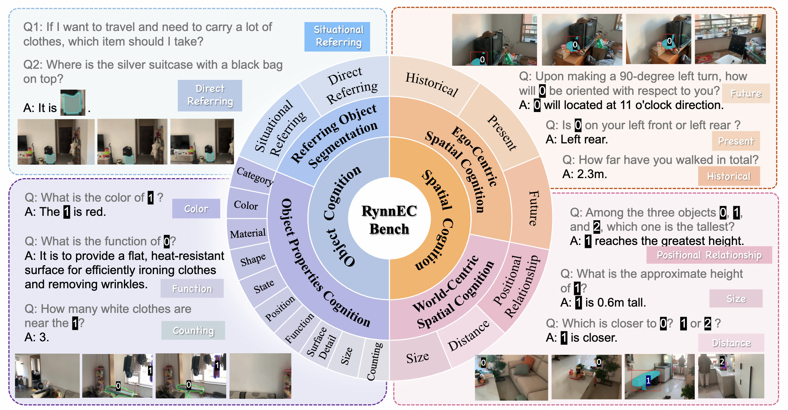

# RynnEC-Bench
[](https://huggingface.co/datasets/Alibaba-DAMO-Academy/RynnEC-Bench)

RynnEC-Bench evaluates fine-grained embodied understanding models from the perspectives of **object cognition** and **spatial cognition** in open-world scenario. The benchmark includes 507 video clips captured in real household scenarios. 

<p align="center">
    
<p>

---
| Model | <font color="red">*Overall Mean* </font> | Object Properties | Seg. DR | Seg. SR | <font color="red">*Object Mean*</font> | Ego. His. | Ego. Pres. | Ego. Fut. | World Size | World Dis. | World PR | <font color="red">*Spatial Mean*</font> |
| :--- | :---: | :---: | :---: | :---: | :---: | :---: | :---: | :---: | :---: | :---: | :---: | :---: |
| GPT-4o | 28.3 | 41.1 | --- | --- | 33.9 | 13.4 | 22.8 | 6.0 | 24.3 | 16.7 | 36.1 | 22.2 |
| GPT-4.1 | 33.5 | 45.9 | --- | --- | 37.8 | 17.2 | 27.6 | 6.1 | 35.9 | 30.4 | 45.7 | 28.8 |
| Genimi-2.5 Pro | 45.5 | 64.0 | --- | --- | 52.7 | 9.3 | 36.7 | 8.1 | 47.0 | 29.9 | 69.3 | 37.8 |
| VideoLLaMA3-7B | 27.3 | 36.7 | --- | --- | 30.2 | 5.1 | 26.8 | 1.2 | 30.0 | 19.0 | 34.9 | 24.1 |
| InternVL3-78B | 29.0 | 45.3 | --- | --- | 37.3 | 9.0 | 31.8 | 2.2 | 10.9 | 30.9 | 26.0 | 20.0 |
| Qwen2.5-VL-72B | 36.4 | 54.2 | --- | --- | 44.7 | 11.3 | 24.8 | 7.2 | 27.2 | 22.9 | 83.7 | 27.4 |
| DAM-3B | 15.6 | 22.2 | --- | --- | 18.3 | 2.8 | 14.1 | 1.3 | 28.7 | 6.1 | 18.3 | 12.6 |
| VideoRefer-VL3-7B | 32.9 | 44.1 | --- | --- | 36.3 | 5.8 | 29.0 | 6.1 | 38.1 | 30.7 | 28.8 | 29.3 |
| Sa2VA-4B | 4.9 | 5.9 | 35.3 | 14.8 | 9.4 | 0.0 | 0.0 | 1.3 | 0.0 | 0.0 | 0.0 | 0.0 |
| VideoGlaMM-4B | 9.0 | 16.4 | 5.8 | 4.2 | 14.4 | 4.1 | 4.7 | 1.4 | 0.8 | 0.0 | 0.3 | 3.2 |
| RGA3-7B | 10.5 | 15.2 | 32.8 | 23.4 | 17.5 | 0.0 | 5.5 | 6.1 | 1.2 | 0.9 | 0.0 | 3.0 |
| RoboBrain-2.0-32B | 24.2 | 25.1 | --- | --- | 20.7 | 8.8 | 34.1 | 0.2 | 37.2 | 30.4 | 3.6 | 28.0 |
| **RynnEC-2B** | **54.4** | **59.3** | **46.2** | **36.9** | **56.3** | **30.1** | **47.2** | **23.8** | **67.4** | **31.2** | **85.8** | **52.3** |
---


## 1. Object Cognition

Object cognition is divided into the object properties cognition task and the referring object segmentation tasks.

### Object Property Cognition 
This subset is designed to evaluate the model's ability to recognize object attributes. It is subdivided into 10 categories: category, color, material, shape, state, position, function, surface detail, size, counting. It comprises a total of 10354 curated data entries. All entries have been manually annotated and verified. 

🌟 **Data Balance**: To address evaluation biases from inconsistent object distributions across houses, we first established a real-world object frequency distribution by analyzing 500k indoor images with GPT-4o. We then employed frequency-based sampling to ensure our benchmark's data mirrors this real-world distribution, and further balanced question difficulty for a more objective and realistic evaluation.


#### Data Format

```json
[
    {
        "video_id": "path to video",
        "video": ["frame id"],
        "conversations": [{"from": "human", "value": "question"}, {"from": "gpt", "value": "answer"}],
        "type": "task type",
        "masks": [{"frame id": {"size": [1080, 1920], "counts": "mask rle"}}],
        "mask_ids": ["which frame is mask in"],
        "timestamps": ["timestamp in video"],
        "class_name": ["object class"] # not for counting
    }
]
```
- `masks`: masks is a list of dicts, every dict is for one object.
- `mask_ids`: The correspondence frame of mask in 'video'.
- All the segmentations are in `RLE` format.

### Referring Object Segmentation
This subset is designed to evaluate the model's ability of precise instance segmentation. The task is divided into direct referring problems and situational referring problems. Direct referring problems involve only combinations of descriptions for the instance, while contextual referring problems are set within a scenario, requiring MLLMs to perform reasoning in order to identify the target object. All entries have been manually annotated and verified. 


#### Data Format

```json
[
    {
        "video_id": "path to video",
        "video": ["frame id"],
        "conversations": [{"from": "human", "value": "question"}],
        "type": "task type",
        "masks": [{"frame id": {"size": [1080, 1920], "counts": "mask rle"}}],
        "mask_ids": ["which frame is mask in"],
        "timestamps": ["timestamp in video"],
    }
]
```

## 2. Spatial Cognition
Spatial cognition involves MLLMs processing egocentric videos to form a 3D spatial awareness. The subset is categorized into two main types: ego-centric and world-centric. Ego-centric cognition focuses on the agent's own relationship with the environment across time, while world-centric cognition assesses the understanding of the objective 3D layout and properties of the world, such as size, distance, and position.

```json
[
    {
        "video_id": "path to video",
        "video": ["frame id"],
        "conversations": [{"from": "human", "value": "question"}, {"from": "gpt", "value": "answer"}],
        "type": "task type",
        "masks": [{"frame id": {"size": [1080, 1920], "counts": "mask rle"}}],
        "mask_ids": ["which frame is mask in"],
        "timestamps": ["timestamp in video"],
    }
]
```

## 3. Data download

The data and annotation of RynnEC-Bench can be downloaded [here](https://huggingface.co/datasets/Alibaba-DAMO-Academy/RynnEC-Bench). You should first unzip the `RynnECBench_data.zip`


Data structure:
```bash
RynnEC
└── data
    └── RynnECBench
        ├── object_cognition.json
        ├── object_segmentation.json
        ├── spatial_cognition.json
        └── data
            └── ...(videos)
```


## 4. Evaluation
**RynnEC-Bench** offers adaptive evaluation for three task types:

- **Numerical Questions:**  
  Precise formulas are used for tasks such as distance, scale, and angle estimation.  
  - *Distance/Scale*: Assessed by Mean Relative Accuracy (MRA).  
  - *Angle*: Assessed by Rotational Accuracy (RoA).

- **Textual Questions:**  
  Answers are scored either binarily or on fine-grained scales using GPT-4o.

- **Segmentation Tasks:**  
  To address challenges in evaluating across all video frames, we introduce the **Global IoU** metric:

<p align="center">
    
<p>

  where   is the number of frames,  is the predicted mask, and  is the ground truth for frame  
  Boundary accuracy  is calculated on non-empty frames.  
  The combined mean provides a robust and fair assessment of segmentation quality.


**Advantages:**  
This framework ensures results are both accurate and consistent across diverse embodied perception tasks.


The evaluation code can be found [here](../evaluation). 


