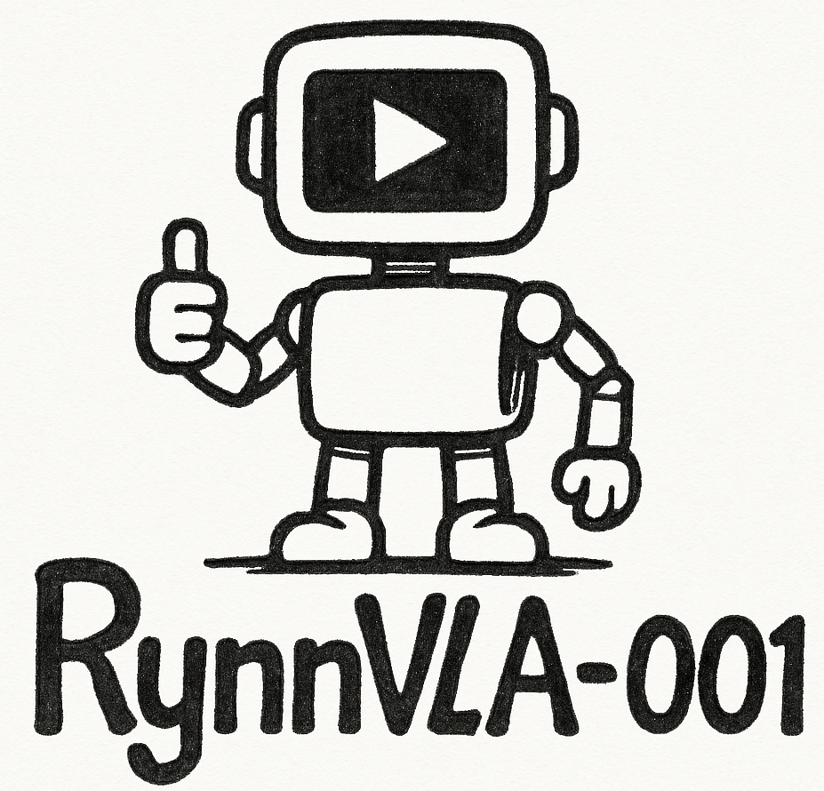
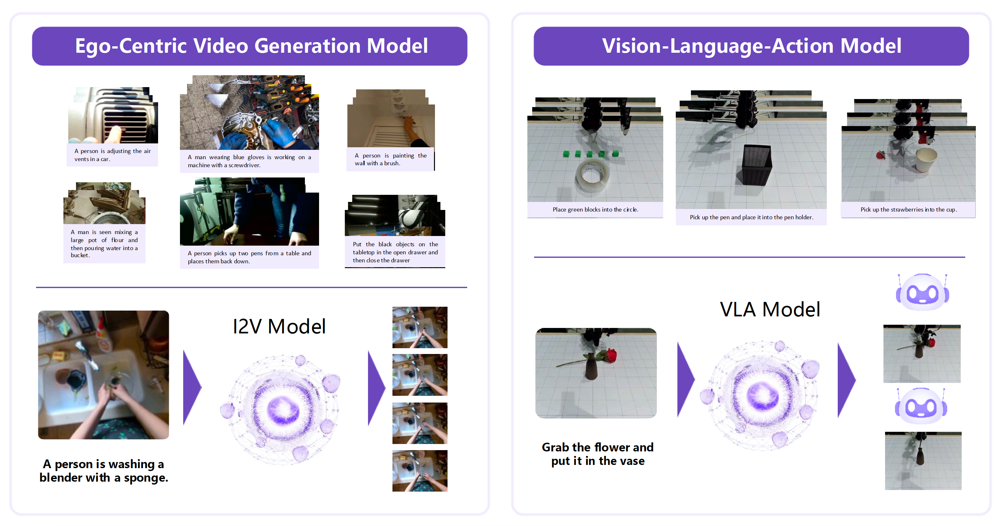
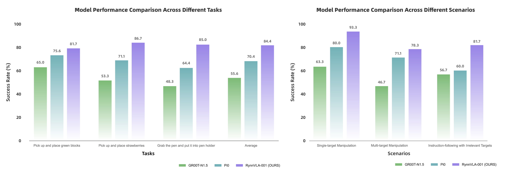
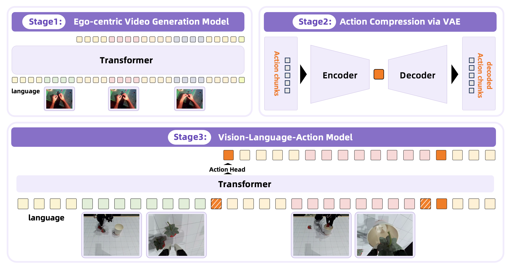

<p align="center">
    
<p>

<h3 align="center"><a href="" style="color:#9C276A">
RynnVLA-001: A Vision-Language-Action Model Boosted by Generative Priors</a></h3>
<h5 align="center"> If our project helps you, please give us a star ⭐ on GitHub to support us. 🙏🙏 </h2>


<p align="center">
        📃 <a href="https://huggingface.co/blog/Alibaba-DAMO-Academy/rynnvla-001"> Tech Blog</a> &nbsp&nbsp | &nbsp&nbsp🤗 <a href="https://huggingface.co/Alibaba-DAMO-Academy/RynnVLA-001-7B-Base">Hugging Face</a>&nbsp&nbsp | &nbsp&nbsp🤖 <a href="https://modelscope.cn/models/DAMO_Academy/RynnVLA-001-7B-Base">ModelScope</a> <br>
        🖥️ <a href="https://youtu.be/egRoJsB2d0c">Demo Video (Youtube) </a>  ｜ &nbsp&nbsp🖥️ <a href="https://www.bilibili.com/video/BV1hVt2zME2B">Demo Video (Bilibili) </a>
<br>

<div align="center"><video src="https://github.com/user-attachments/assets/21657318-8507-4a80-ae82-4078fd80303d" width="800" autoplay loop muted></div>


## 📰 News

* **[2025.08.08]**  🔥🔥 Release our pretrained models and training code.


## 🌟 Introduction
RynnVLA-001 is a VLA model based on pretrained video generation model. The key insight is to implicitly transfer manipulation skills learned from human demonstrations in ego-centric videos to the manipulation of robot arms.
<p align="center">


<p>

We finetune the baseline on the same dataset to evaluate the performance. The comparison results are shown in the following figure.
<p align="center">


<p>

## 🛠️ Requirements and Installation

Install required packages:

```bash
pip install torch==2.2.0 torchvision==0.17.0 --index-url https://download.pytorch.org/whl/cu121

pip install -r requirements.txt

pip install flash-attn==2.5.8
```

## 🗝️ Training

The training pipeline are shown as follows:

<p align="center">


<p>

Here we provide instructions on how to finetune the model with your own LeRobot data （Stage 2 and Stage 3). We will release instructions on how to train models from scratch. Stay tuned!

### Step 1: Prepare Pretrained Models

Download [Chameleon](https://huggingface.co/Alpha-VLLM/Chameleon_7B_mGPT) Model and pretrained [RynnVLA-001-7B-Base](https://huggingface.co/Alibaba-DAMO-Academy/RynnVLA-001-7B-Base) models, and put the downloaded model under `pretrained_models`. The structure of the folder `pretrained_models` should be:
```bash
pretrained_models
├── Chameleon
│   ├── original_tokenizers
│   │   ├── text_tokenizer.json
│   │   ├── vqgan.ckpt
│   │   └── vqgan.yaml
│   ├── config.json
│   └── ...
└── RynnVLA-001-7B-Base
```

### Step 2: Prepare Training Data

If you have your own LeRobot data, please convert your LeRobot data into the hdf5 format. Here, we provide the conversion scripts. To execute the conversion successfully, we recommend you to install a seperate environment as suggested in [LeRobot](https://github.com/huggingface/lerobot) repo.

```bash
python misc/lerobot_data_convert.py --dataset_dir path-to-raw-lerobot-data --task_name dataset-name --save_dir path-to-save-hdf5-files
```

After the data conversion, you need to save the statistics and paths of all your data into a json file. You can use the following scripts to generate the json file. Before you run the scripts, please change the data path in the `misc/merge_data/config.yaml`.

```bash
cd misc/merge_data

python misc/data_process_with_configs.py -c misc/merge_data/config.yaml
```

### Step 3: Prepare training script

Before you start training, please change the paths in `./configs/actionvae/actionvae_lerobot.yml` and `./configs/lerobot/lerobot_exp.yml` to corresponding local paths.

```bash
# Stage 2
# Empirically, we train action_vae on our dataset for 30000 iterations with batch size of 16 * 8 (GPUs).
# You may visualize the reconstructed trajectory to check the quality.
bash scripts/actionvae/action_vae.sh

# Stage 3
bash scripts/lerobot/lerobot.sh
```
## 🤖 Inference

Here, we provide an example code for the inference on lerobot. You can adapt this code to interact with your robot arm for input and output.

Please refer to `inference_lerobot.py` for details.

You may need to upgrade the version of transformers to 4.46.3 if any error occurs.


## 👍 Acknowledgement
The codebase of our RynnVLA-001 is refactored from [**Lumina-mGPT**](https://github.com/Alpha-VLLM/Lumina-mGPT) and [**Chameleon**](https://github.com/facebookresearch/chameleon). If your work is used in RynnVLA-001 but not mentioned in either this repo or the technical report, feel free to let us know :heart:.

<details open><summary>💡 Other featured projects from our RynnBot family ✨. </summary><p>
    
<!--  may -->
> [**RynnEC: Bringing MLLMs into Embodied World**](https://github.com/alibaba-damo-academy/RynnEC) <br>
> Ronghao Dang*, Yuqian Yuan*, Yunxuan Mao*, Kehan Li*, Jiangpin Liu, Zhikai Wang, Fan Wang, Deli Zhao, Xin Li <br>
[](https://github.com/alibaba-damo-academy/RynnEC)  [](https://github.com/alibaba-damo-academy/RynnEC) [](https://arxiv.org/abs/2508.14160) <be> 

> [**RynnRCP: Open Robotics Context Protocol and RobotMotion**](https://github.com/alibaba-damo-academy/RynnRCP) <br>
> RynnBot Team <br>
[](https://github.com/alibaba-damo-academy/RynnRCP)  [](https://github.com/alibaba-damo-academy/RynnRCP)  <br>

> [**WorldVLA: Towards Autoregressive Action World Model**](https://arxiv.org/abs/2506.21539) <br>
> Jun Cen, Chaohui Yu, Hangjie Yuan, Yuming Jiang, Siteng Huang, Jiayan Guo, Xin Li, Yibing Song, Hao Luo, Fan Wang, Deli Zhao, Hao Chen <br>
[](https://github.com/alibaba-damo-academy/WorldVLA)  [](https://github.com/alibaba-damo-academy/WorldVLA)  [](https://arxiv.org/abs/2506.21539) <br>

</p></details>


## 🔒 License

This project is released under the Apache 2.0 license as found in the LICENSE file.
The service is a research preview intended for **non-commercial use ONLY**. Please get in touch with us if you find any potential violations.


